# Who Pays for Growth? — The Fire-Fiscal Master Report

### Value, infrastructure, and fire service across the Austin metro

**Prepared by:** Austin Housing & Land Use Working Group — Research Hub
**Date:** June 2026 · **Analysis vintage:** 2025 appraisal values · 2022–2024 fire incidents
**Companion artifacts:** `outputs/fire_fiscal_interactive_map.html` (interactive 3D map) · `outputs/validation_report.csv` (data validation gate)

---

> **How to read this.** It's long, so it's built to be read at whatever depth you have time for:
>
> | Time | Read |
> |---|---|
> | **2 minutes** | §1 |
> | **15 minutes** | §1, §2, §6 |
> | **the whole thing (~45 min)** | everything, including the calculations (§5) and appendices (§10–13) |
>
> The charts use two color keys — one for *value per acre*, one for *fire net balance*. You don't need to memorize them; the key is laid out in [§10](#the-color-key).
>
> The headline figures are machine-reconciled against the source data — §11 is the reconciliation table, and it is explicit about which rows are recomputed and which are sourced constants — and each figure footnotes the exact line of code that produces it.

[TOC]

---

## 1 · Executive summary

The question is simple: **can each part of the metro pay its own way?** Does it bring in enough public revenue to cover the infrastructure and services it uses? We test that three ways — land value per acre,[^vpa] road cost, and fire-service cost — each from a separate dataset.

The three lenses agree. What decides whether an area pays its way is its **value per unit of infrastructure** — not whether you call it a city or a suburb. Dense, high-value land, plus a few wealthy low-density enclaves, brings in far more than it costs to serve. Low-value, low-density development — the unincorporated fringe and the road-heavy growth suburbs — does not, and the dense core covers the gap.

Three unrelated measurements (property value, road-miles, fire standby) point the same way, so the finding doesn't rest on any one method.[^converge]

It is not simply suburb-versus-city. West Lake Hills, Lakeway, and Rollingwood pay their way because their land is valuable enough to clear the bar, even at low density. The areas that fall short are the broad band of **low-value, low-density development** — much of it newer growth suburbs and unincorporated subdivision.

[^vpa]: The value-per-acre lens comes from the Strong Towns movement and the Urban3 mapping practice: Charles L. Marohn Jr., *Strong Towns: A Bottom-Up Revolution to Rebuild American Prosperity* (Hoboken, NJ: Wiley, 2019); Joseph Minicozzi, "The Smart Math of Mixed-Use Development," *Planetizen*, January 23, 2012, https://www.planetizen.com/node/53922; and, for the method itself, Daniel Herriges, "Value Per Acre Analysis: A How-To for Beginners," *Strong Towns*, October 19, 2018, https://www.strongtowns.org/journal/2018/10/19/value-per-acre-analysis-a-how-to-for-beginners. Full citations for every source are in the [bibliography](#bibliography).

[^converge]: The convergence argument is developed in full in [§8](#8--why-the-data-support-the-conclusion). A bias in any single method (e.g. the blended tax rate, the uniform-cost assumption) cannot explain agreement across three different agencies, units, and methods.

---

## 2 · Key concepts

A short definition of each idea the report uses, with a picture. The full [glossary](#12--glossary) at the end covers every term.

### 2.1 Land value, and market vs. assessed/appraised value

- **Market value** — what an appraisal district estimates a property would sell for. This is the figure we use for revenue, because property tax is levied against value.
- **Appraised / assessed value** — market value after caps and exemptions (e.g. the 10% homestead cap[^hscap]). Taxes are actually levied on this; we use it for the tax-per-acre lens and market value for the value lens. (The assessed-value `tax_per_acre` column is **Travis-only** in the current build — the Williamson/Hays feeds carry market value only — so every metro-wide dollar figure in this report uses market value.)

So "value" throughout is the appraisal district's estimate of what the land and buildings are worth — the number the tax rate gets multiplied against.

[^hscap]: Tex. Tax Code § 23.23 ("Limitation on Appraised Value of Residence Homestead"), Texas Constitution and Statutes, accessed July 1, 2026, https://statutes.capitol.texas.gov/GetStatute.aspx?Code=TX&Value=23.23. The cap limits year-over-year growth in a homestead's appraised value to 10% plus the value of new improvements.

### 2.2 Value per acre

The central idea, borrowed from the Strong Towns / Urban3 framing:[^vpa] **public infrastructure cost scales with land *area*** (linear feet of road and pipe, geographic coverage to patrol and serve), while **public revenue scales with property *value***. So the meaningful productivity ratio is value **per acre**.

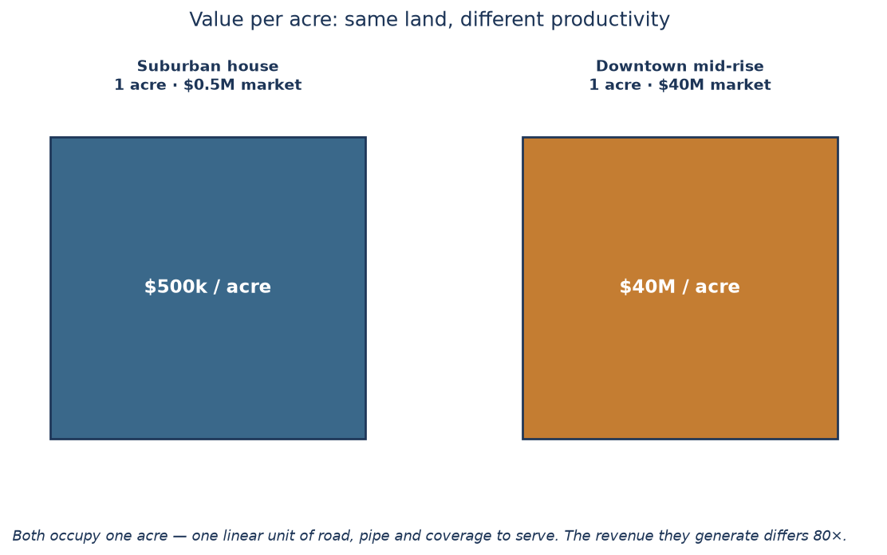

Two parcels can sit on the same acre — same road, same pipe, same area to cover — yet one brings in 80× the tax. Value per acre is what makes that visible.

### 2.3 Effective tax rate

Revenue is `value × an effective tax rate`. The **effective** rate blends every overlapping jurisdiction — City of Austin, the county, the school district (AISD), the community college (ACC), and special districts — into one number applied to market value. We use a blended **~2.1%**.[^rate] A uniform rate **cancels** in any relative (above/below average) comparison, so the *pattern* does not depend on getting the rate exactly right — only the absolute dollars do.

[^rate]: Adopted 2024 (FY2024-25) rates per $100 of value — City of Austin 0.4776, Travis County 0.3444, Austin ISD 0.9505, Austin Community College 0.1013 (≈1.87% combined; ≈1.98% adding Central Health): Travis County Tax Office, "Truth in Taxation Summary" (posted under Tex. Tax Code § 26.16), accessed July 1, 2026, https://www.traviscountytx.gov/tax-rates. The model's 2.1% blend sits slightly above that sum to stand in for the remaining special districts; because the rate is applied uniformly, any error in it cancels in every relative comparison. `EFFECTIVE_TAX_RATE = 0.021` is defined once at `report_pipeline/13_build_metro_parcels.py:22` and reused everywhere — see [§11](#11--validation-appendix).

### 2.4 Fiscal productivity & break-even

An area **breaks even** when its revenue equals its cost-to-serve. Above the line it is a **net contributor**; below it, it is **cross-subsidized** by other areas.

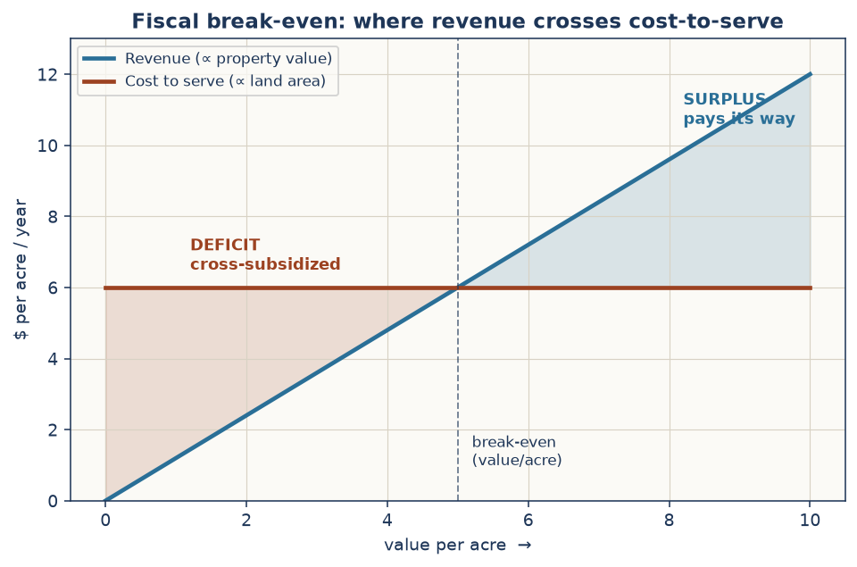

Plot what an area pays in against what it costs to serve. Where the two lines cross is break-even. The whole report is really about who sits above that line and who sits below.

### 2.5 Fire coverage vs. fire demand

A fire department's cost is mostly **standby**, not response. Roughly **90%** of a fire budget pays to keep a staffed company ready 24/7 within response-time reach[^nfpa] of every zone — whether or not that zone calls often.[^standby] So there are two very different ways to measure "use":

- **Demand** — how many (cost-weighted) calls a zone generates.
- **Coverage** — the fixed cost of keeping a first-due company able to reach that zone in time.

[^standby]: The cited sources put **personnel** at more than 90% of a fire budget; reading that as *standby* is this report's inference — justified because fire staffing is scheduled by shift, not by call volume, so personnel cost is fixed with respect to demand. "As public safety is a labor-intensive service model, typically more than 90% of the budget is accounted for by personnel costs": Steven Knight, "Doing More with Less: Fire Department Budgets, Fiscal Responsibility," *FireRescue1*, August 14, 2018, https://www.firerescue1.com/fire-chief/articles/doing-more-with-less-fire-department-budgets-fiscal-responsibility-GTj33j3axJ2tfshe/. For a worked line-item example (>90% non-discretionary once payroll, stations, and apparatus are counted): Steve Pegram, "Budget Breakdown: The Real Cost of Operating a Fire Department," *FireRescue1*, October 8, 2021, https://www.firerescue1.com/fire-products/administration-billing/articles/budget-breakdown-the-real-cost-of-operating-a-fire-department-uB62rUFtPgUf8ZpZ/.

[^nfpa]: Response-time coverage benchmarks for career fire departments are set by National Fire Protection Association, *NFPA 1710: Standard for the Organization and Deployment of Fire Suppression Operations, Emergency Medical Operations, and Special Operations to the Public by Career Fire Departments*, 2020 ed. (Quincy, MA: NFPA, 2020), https://www.nfpa.org/codes-and-standards/nfpa-1710-standard-development/1710. NFPA 1710 was consolidated into NFPA 1750 for the 2026 edition; the 2020 edition is the last standalone one.

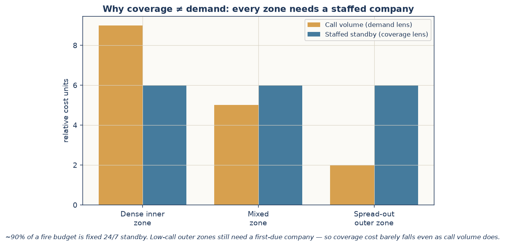

A quiet outer zone still needs a station that can reach it in time. Most of the cost is being ready, not running calls — so which area "uses the most" depends entirely on which lens you pick.

### 2.6 Apparatus weighting

Not every call or station costs the same. A full first-alarm structure fire commits far more crew and equipment than a trash fire, and a station housing several companies (engine + ladder + rescue) costs more to keep staffed than a single-engine house. We weight incidents by type[^weights] and stations by their actual apparatus[^appw] — the weight sums across a station's units (with a premium for quints), so multi-company houses cost more — and the cost lens reflects real resource intensity.

[^weights]: `WEIGHTS = {structure fire 10, confined 5, vehicle/outdoor 2, trash 1}` — `notebooks/fire_use_vs_pays.ipynb` cell 2. Applied at cell 4. Validated: 20,920 incidents → 65,166 weighted ([§11](#11--validation-appendix)).
[^appw]: `APP_W = {ENG 1.0, LAD 1.0, QNT 1.2, RES 0.8}`, battalion units 0.5 — `notebooks/fire_use_vs_pays.ipynb` cell 10.

---

## 3 · The data inputs

The analysis draws on three groups of sources, feeding three models, producing three findings. The grouping is by **function**: what each source measures.

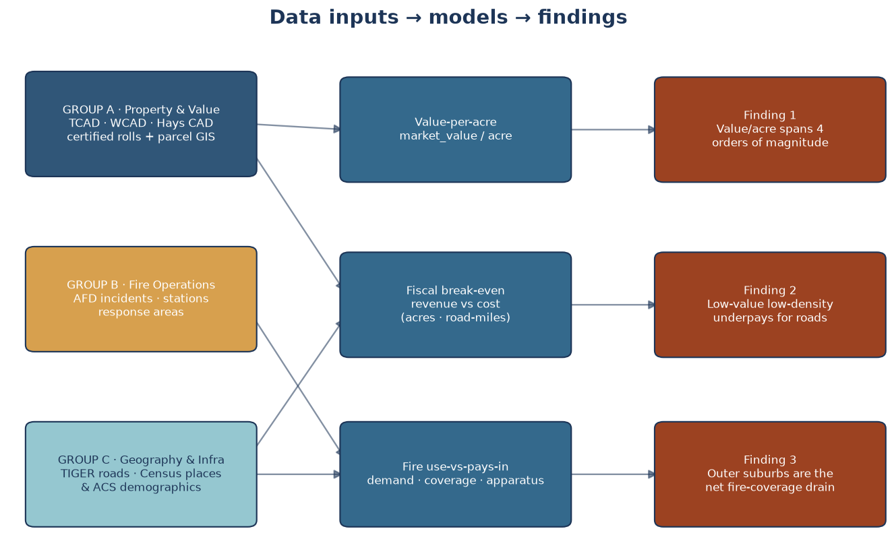

- **Group A · Property & Value** — the appraisal rolls and parcel geometry that tell us what land is worth and how big it is. Feeds the value-per-acre and fiscal models.
- **Group B · Fire Operations** — AFD's incidents, stations, and response areas: the real consumption data for the fire model.
- **Group C · Geography & Infrastructure** — the federal road network, city boundaries, and Census demographics that supply the cost basis (road-miles) and the equity overlay.

---

## 4 · The data sources, in detail

For each source: what the agency is, what the dataset is, its vintage, why it's the authoritative source, and what we use it for.

### 4.1 Property & value (Group A)

**What we use it for:** every dollar figure in the report — the value-per-acre map, the fiscal break-even (both cost models), and each area's fire pays-in. Without it there is no revenue side to the ledger.

| Source | Agency | What it is | Parcels used (post-filter) | Vintage | Why authoritative |
|---|---|---|---|---|---|
| **Travis parcels** | **TCAD** (Travis Central Appraisal District) | Public parcel GIS geometry[^travisgeo] joined to the **2025 Certified Appraisal Roll** (PACS `PROP.TXT` fixed-width export), by `PROP_ID` | 373,471 | 2025 certified | TCAD is the *statutory* appraiser for Travis County (Tex. Property Tax Code). The certified roll is the legal basis for every tax bill in the county.[^tcad] |
| **Williamson parcels** | **WCAD** via Williamson County GIS ArcGIS FeatureServer | Parcels bundling `TotalPropMktValue` + geometry + `AssessedAc` + use | 265,506 | current cycle | WCAD is the statutory appraiser for Williamson County; the county GIS republishes its certified values.[^wcad] |
| **Hays parcels** | **Hays CAD** ArcGIS FeatureServer (`countygis.DBO.Parcels`) | Parcels with `market`, `land_val`, `imprv_val`, `legal_acreage` | 85,662 | current cycle | Hays CAD is the statutory appraiser for Hays County.[^hayscad] |
| **Cross-county comparability** | **Texas Comptroller** Property Value Study / Appraisal District Ratio Study | Median appraisal-to-sale ratio, Category A | — | 2022–2024 ADRS | The Comptroller independently audits each district's level of appraisal; we divide by these ratios so a dollar of "market value" means the same across counties.[^pvs] |

[^tcad]: Travis Central Appraisal District, "Public Information," 2025 Certified Export (July) — the certified appraisal-roll data download, accessed July 1, 2026, https://traviscad.org/publicinformation/. **Provenance note.** Travis per-property values are withheld from the statewide StratMap dataset and gated behind the appraisal-district web portal, but the **full certified roll is published free** — the downloaded ZIP contains a fixed-width PACS export (`PROP.TXT`), which we parse directly with `report_pipeline/12_parse_tcad_roll.py`. The chief appraiser prepares and certifies the roll to each taxing unit every July under Tex. Tax Code § 26.01 ("Submission of Rolls to Taxing Units," https://statutes.capitol.texas.gov/GetStatute.aspx?Code=TX&Value=26.01), so the pipeline refreshes to a newer year by re-running one parser on the new `PROP.TXT`.
[^travisgeo]: City of Austin, Housing and Planning Department, "Land Database Dash View" (2023 Land Database), ArcGIS feature service, layer 93 (`main.land_database_reorder`), last edited May 28, 2026, accessed July 1, 2026, https://services.arcgis.com/0L95CJ0VTaxqcmED/arcgis/rest/services/2023_Land_Database_Dash_View/FeatureServer/93. Geometry merged from the Travis, Williamson, Hays, and Bastrop appraisal-district parcel layers; coverage spans Austin's full- and limited-purpose jurisdiction and ETJ.
[^wcad]: Williamson County GIS, "WCAD Parcels" — parcel geometry and appraisal values from the Williamson Central Appraisal District, ArcGIS map service, layer 0, updated daily, accessed July 1, 2026, https://gis.wilco.org/arcgis/rest/services/public/county_wcad_parcels/MapServer/0.
[^hayscad]: Hays County Development Services, GIS Division, "Hays County Parcels," ArcGIS feature service, layer 0 (`countygis.DBO.Parcels`), last updated March 2026, accessed July 1, 2026, https://services5.arcgis.com/bVphnK8rPe5MHUSr/arcgis/rest/services/Hays_County_Parcels/FeatureServer/0.
[^pvs]: Texas Comptroller of Public Accounts, "2024 Appraisal District Ratio Study" (conducted under Tex. Tax Code § 5.10), county worksheets accessed July 1, 2026 — Travis (227): https://comptroller.texas.gov/auto-data/PT2/ratio-study/2024/2270000001A.php; Williamson (246): https://comptroller.texas.gov/auto-data/PT2/ratio-study/2024/2460000001A.php; Hays (105), **2022 study** (biennial cycle — 2022 is the most recent for Hays): https://comptroller.texas.gov/auto-data/PT2/ratio-study/2022/1050000001A.php. `PVS_RATIOS = {travis 1.00, williamson 0.96, hays 0.97}` with the per-county ADRS citations in `report_pipeline/v2_county_sources.py`. Applied as `value_per_acre_adj = (market_value / pvs_ratio) / land_acres` at `report_pipeline/13_build_metro_parcels.py`.

### 4.2 Fire operations (Group B)

**What we use it for:** the fire model — which areas generate calls (demand), where the stations actually are (coverage and distance), and the response-area zones we balance "use" against "pays-in."

| Source | Agency | What it is | Records | Vintage | Why authoritative |
|---|---|---|---|---|---|
| **Fire incidents** | **Austin Fire Department**, via the [Austin Open Data Portal](https://data.austintexas.gov/Public-Safety/AFD-Fire-Incidents-2023-2025/v5hh-nyr8) | Per-incident type, response area, location — enriched here with parcel + tract | 20,920 | 2022–2024 | AFD is the dispatching authority; this is its own operational record of every fire call.[^afdinc] |
| **Fire stations** | City of Austin `LOCATION_fire_stations` ArcGIS FeatureServer | Station points with apparatus in `RESOURCES` | 64 AFD | current | The City's authoritative facilities layer (apparatus assignments included).[^stationsrc] |
| **Response areas** | City of Austin `BOUNDARIES_afd_response_areas` ArcGIS FeatureServer | First-due operational zones | 765 (285 served) | current | The operational unit AFD itself uses to assign first-due companies.[^respsrc] |

[^afdinc]: Austin Fire Department, "AFD Fire Incidents 2023–2025" (dataset ID `v5hh-nyr8`), City of Austin Open Data Portal, updated April 20, 2026, accessed July 1, 2026, https://data.austintexas.gov/Public-Safety/AFD-Fire-Incidents-2023-2025/v5hh-nyr8. The dataset's title rolls forward annually over the same dataset ID; this analysis used the 2022–2024 window, downloaded when the dataset was titled "AFD Fire Incidents 2022–2024."
[^stationsrc]: City of Austin, "Fire Stations" (`LOCATION_fire_stations`), ArcGIS feature service, accessed July 1, 2026, https://services.arcgis.com/0L95CJ0VTaxqcmED/arcgis/rest/services/LOCATION_fire_stations/FeatureServer.
[^respsrc]: Austin Fire Department, "AFD Response Areas" (`BOUNDARIES_afd_response_areas`), ArcGIS feature layer, CTM 911 Addressing GIS, accessed July 1, 2026, https://services.arcgis.com/0L95CJ0VTaxqcmED/arcgis/rest/services/BOUNDARIES_afd_response_areas/FeatureServer/0.

### 4.3 Geography & infrastructure (Group C)

**What we use it for:** the road-cost model (Model B) needs the road network; the city boundaries put each parcel in the right jurisdiction; the Census demographics supply the density and housing-age context.

| Source | Agency | What it is | Vintage | Why authoritative |
|---|---|---|---|---|
| **Roads** | **US Census Bureau** TIGER/Line | Local road network (interstates excluded) | 2023 | The federal standard geographic road network; consistent nationwide.[^tiger] |
| **City boundaries** | US Census Bureau cartographic "places" | Incorporated-place polygons (TX) | 2023 | Authoritative municipal boundaries.[^cbplaces] |
| **Demographics** | US Census Bureau **ACS 5-year** (B01003 population, B25024 units, B25034 year-built) | Tract-level housing & population | 2018–2022 5-yr | The standard small-area demographic estimates, area-weighted to response areas.[^acssrc] |

[^tiger]: U.S. Census Bureau, "TIGER/Line Shapefiles: Roads, 2023" (county-based All Roads files), accessed July 1, 2026, https://www.census.gov/geographies/mapping-files/time-series/geo/tiger-line-file.html. Interstates and other limited-access primary roads are identified for exclusion by MTFCC code `S1100`: U.S. Census Bureau, "Appendix E: MAF/TIGER Feature Class Code (MTFCC) Definitions," in *TIGER/Line Shapefiles 2023 Technical Documentation* (October 2023), https://www2.census.gov/geo/pdfs/maps-data/data/tiger/tgrshp2023/TGRSHP2023_TechDoc.pdf.
[^cbplaces]: U.S. Census Bureau, "Cartographic Boundary Files: Places, Texas, 1:500,000" (`cb_2023_48_place_500k`; boundaries as of January 1, 2023), accessed July 1, 2026, https://www.census.gov/geographies/mapping-files/time-series/geo/cartographic-boundary.html.
[^acssrc]: U.S. Census Bureau, "Total Population" (table B01003), "Units in Structure" (table B25024), and "Year Structure Built" (table B25034), American Community Survey 2018–2022 Five-Year Estimates, census-tract level, accessed July 1, 2026, via the Census Bureau API, https://api.census.gov/data/2022/acs/acs5.

---

## 5 · Calculations and methodology

Every formula is written out, with a worked example and a footnote pointing to the exact code that runs it.

### 5.1 Value per acre

```
value_per_acre = market_value / land_acres
```

Acreage comes from the CAD attribute where present and from the **parcel geometry footprint** (projected to EPSG:2277, Texas Central State Plane) where the CAD leaves it null — which fills in the **13.8%** of Travis parcels (about 18% of platted-lot-size parcels) whose CAD acreage field is empty.[^acres] For display, extreme values are clipped at high percentiles (95th–99th, varying by figure); in the parcel build itself, parcels under 0.01 acre (data-artifact slivers) and per-acre values outside $1–$10¹²/acre are dropped.

> **Worked example.** A downtown parcel worth $40,000,000 on 1.0 acre → **$40,000,000/acre**. A suburban house worth $500,000 on 1.0 acre → **$500,000/acre**. Same footprint; 80× the productivity.

[^acres]: Acreage fallback (CAD acres where positive, else parcel-geometry area in EPSG:2277) is implemented in `build_travis()`, `report_pipeline/13_build_metro_parcels.py`. The roll's `legal_acreage` field sits between the two in the code but in practice fills none of the missing rows — the geometry footprint covers all 51,545 of them. Projection: "NAD83 / Texas Central (ftUS)," EPSG:2277, EPSG Geodetic Parameter Dataset (IOGP), accessed July 1, 2026, https://epsg.org/crs_2277/NAD83-Texas-Central-ftUS-.html.

### 5.2 Revenue

```
revenue = market_value × EFFECTIVE_TAX_RATE        (EFFECTIVE_TAX_RATE = 0.021)
```

Summed across all 724,639 metro parcels this yields **≈ $12.56 billion/yr** in modeled property-tax revenue on **≈ $597.9 billion** of market value.[^rev]

[^rev]: `revenue = market_value × EFFECTIVE_TAX_RATE` — `notebooks/fiscal_productivity.ipynb` (the rate constant is defined once at `report_pipeline/13_build_metro_parcels.py:22`). The $597.9B / $12.56B totals are reconciled in [§11](#11--validation-appendix). Note the revenue model applies the rate to **market** value; actual bills are levied on taxable value after caps and exemptions, so $12.56B is the model's calibration total, not a collections forecast — the relative pattern is what carries. (A separate `tax_per_acre` column applying the rate to taxable value is built at `13_build_metro_parcels.py:66`, but taxable value is populated for **Travis only** in the current build.)

### 5.3 Fiscal break-even — two cost models

Each model is **calibrated so the metro breaks even in aggregate**, so the output is *who is above/below average*, independent of the exact budget.

- **Model A — cost ∝ land area.** `break_even_per_acre = total_levy / total_acres`; `net_per_acre = tax_per_acre − break_even_per_acre`. Over **all** land, rural tracts included, the metro-wide break-even is **$8,421/acre**. For the city-vs-city comparison in [§6.2](#62-fiscal-productivity--the-cost-model-changes-the-verdict) the model is recalibrated on **developed land only** — parcels ≤ 5 acres (`DEVELOPED_ACRE_MAX = 5.0`), which excludes rural/ag tracts — where the break-even rises to **$30,781/acre**; that is the bar the §6.2 verdicts are judged against, and only cities with ≥ 500 covered parcels (`MIN_CITY_PARCELS`) are reported.[^modelA]
- **Model B — cost ∝ local road-miles** (the Strong Towns "value per road-mile").[^vprm] Cost is allocated by the local road network each area carries (TIGER roads, excluding state-maintained interstates), calibrated the same way: total developed-parcel revenue ÷ total local road-miles across the reported cities gives one cost per road-mile. This is the better proxy, since public infrastructure cost follows linear feet of road and pipe more closely than raw acreage.

[^vprm]: Marohn, *Strong Towns*; Herriges, "Value Per Acre Analysis" — the road-mile variant normalizes value to the linear infrastructure an area carries rather than its acreage.

> **Worked example (Model A, all-land bar).** A parcel paying $12,000/acre in tax sits **+$3,579/acre above** the $8,421 all-land break-even — a net contributor. One paying $4,000/acre sits **−$4,421/acre below** — cross-subsidized. *(The §6.2 city verdicts use the stricter developed-only bar of $30,781/acre.)*

[^modelA]: Both break-evens computed in `notebooks/fiscal_productivity.ipynb` (`fiscal()`, with `DEVELOPED_ACRE_MAX` and `MIN_CITY_PARCELS` in its Config cell); the all-land figure ($8,421/acre) is a validation check in [§11](#11--validation-appendix).

### 5.4 Fire service — use vs. pays-in

AFD is funded city-wide from one pot, so every area's property tax helps fund all fire service. Per AFD **response area**:

```
pays_in   = (area_property_value / total_city_value) × AFD_BUDGET
```

with `AFD_BUDGET ≈ $264M`.[^budget] **Use** is measured three ways:

```
value_share     = prop_value / Σ prop_value
callcost_share  = weighted_calls / Σ weighted_calls          # demand lens
coverage_share  = 1 / N_served_areas                          # flat coverage lens
net_demand    = (value_share − callcost_share)  × AFD_BUDGET
net_coverage  = (value_share − coverage_share)  × AFD_BUDGET
```

The **apparatus-weighted** coverage lens scales each zone's `coverage_share` by the apparatus weight of its **nearest station** — a centroid-to-station `sjoin_nearest` in EPSG:2277, used as a proxy for the true first-due assignment. The same join gives each zone's **distance to the nearest AFD station**, a direct measure of coverage stretch.[^net]

> **Worked example.** A downtown zone holding 3% of citywide value but generating 1% of weighted calls has `net_demand = (0.03 − 0.01) × $264M = +$5.3M` — it pays in far more than its call volume "uses." Under the **coverage** lens, a spread-out outer zone holding 0.2% of value but consuming `1/285 = 0.35%` of standby has `net_coverage = (0.002 − 0.0035) × $264M = −$0.4M` — a net drain on coverage.

[^budget]: City of Austin, *Fiscal Year 2024–25 Approved Budget* (Austin, TX: City of Austin, adopted August 14, 2024), accessed July 1, 2026, https://austin.widen.net/view/pdf/urye2vx23m/FY-2024-25-City-of-Austin-Approved-Budget.pdf. The approved AFD General Fund requirement is **$262,205,476** (pp. 300, 453); the model's `AFD_BUDGET = 264_000_000` (`notebooks/fire_use_vs_pays.ipynb` cell 2) matches the widely reported proposed-budget figure. The constant scales the fire dollars only; the relative pattern is budget-invariant — see [§11](#11--validation-appendix).
[^net]: Net-balance assembly: `notebooks/fire_use_vs_pays.ipynb` cells 6–10. **Conservation** (`Σ value_share = 1`, each cost share sums to 1, net columns sum ≈ 0) is asserted as a validation check.

---

## 6 · Results

### 6.1 Value per acre — the Urban3 pattern holds

Across **724,639 metro parcels**, value per acre spans four orders of magnitude. Downtown Austin H3 hexes[^h3] top the metro at **$17–43 million per acre**; the old-town cores of the suburbs (Georgetown Square, Round Rock, San Marcos) stand out as local peaks above their surroundings; the rural fringe and big-lot tracts sit at the bottom. The highest value-per-acre parcels are downtown high-rise office, condos, and hotels; the lowest are large, low-value or undeveloped tracts.

*The value-per-acre surface is best read interactively: it is the extruded "Value per acre (3D)" layer in the companion `outputs/fire_fiscal_interactive_map.html` (and visible in the [§7 map preview](#7--places-you-know)). It regenerates from `parcels_value_per_acre_metro.parquet` via `notebooks/value_per_acre_metro.ipynb`.*

[^h3]: Uber Technologies, *H3: A Hexagonal Hierarchical Geospatial Indexing System*, documentation, accessed July 1, 2026, https://h3geo.org/. Parcels are aggregated to H3 resolution-8 cells for the metro value surface.

### 6.2 Fiscal productivity — the cost model changes the verdict

Model A charges every area by its land area; Model B charges by the local road-miles it actually carries. Both are computed on **developed land only** (parcels ≤ 5 acres) against the $30,781/acre developed break-even — the fair city-vs-suburb test set up in [§5.3](#53-fiscal-break-even--two-cost-models). Model B is the better proxy, because public infrastructure cost follows linear feet of road and pipe more closely than raw acreage. Switching from A to B sharpens the picture and **flips the verdict for 11 cities** — the deciding variable becomes value per road-mile.

What decides a flip is value **per road-mile**, not home value alone. Four road-heavy growth suburbs flip to net drains (Buda, Georgetown, Kyle, Wells Branch); seven flip the other way, to contributor — most of them high-value (Bee Cave, Point Venture, Shady Hollow), but also modest Elgin, which clears the bar because it carries barely five road-miles. The familiar names:[^verdicts]

| City | Median home value | Land-cost model (A) → road-cost model (B) |
|---|---|---|
| West Lake Hills | ~$1.74M | contributor under both — strengthens (high value, few road-miles) |
| Bee Cave | ~$835k | **flips to contributor** |
| Lakeway | ~$740k | contributor under both — strengthens |
| *Austin (reference)* | ~$495k | contributor under both |
| Buda | ~$404k | **flips to net drain** |
| Georgetown | ~$375k | **flips to net drain** |
| San Marcos | ~$327k | net drain under **both** models |
| Kyle | ~$315k | **flips to net drain** |

The unincorporated county runs a deficit of about **−$2 billion/yr under both models**. One asymmetry to keep in mind: Model B charges each label for *all* local roads inside it — for "Unincorporated," the whole rural network outside city limits — while its revenue counts only developed (≤ 5-acre) parcels, so Model B's version of that deficit is somewhat overstated. That the same-sized gap also appears under Model A, which has no such asymmetry, is what supports reading it as genuinely road-heavy, lower-value subdivision rather than a cost-model artifact.

[^verdicts]: The full 46-city ledger — revenue, acres, road-miles, both nets, median home value, and verdict — is exported by `notebooks/fiscal_productivity.ipynb` to `outputs/city_fiscal_verdicts.csv`. The 11 verdict-changers: Bee Cave, Elgin, Liberty Hill, Manor, Point Venture, Shady Hollow, Woodcreek (→ contributor); Buda, Georgetown, Kyle, Wells Branch (→ net drain).

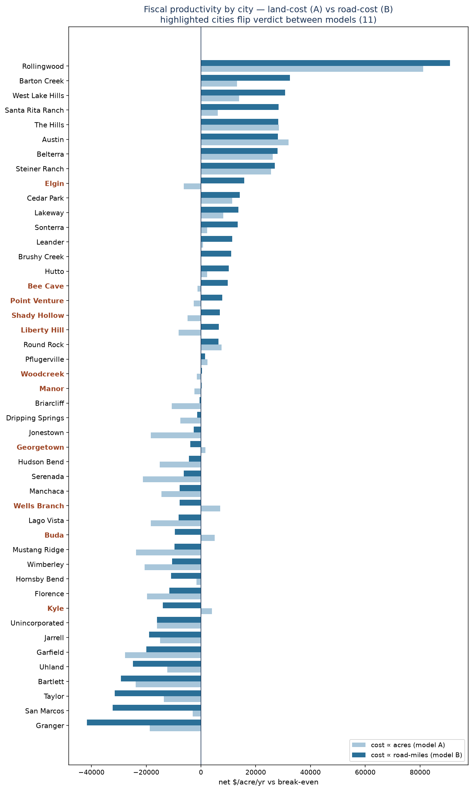

*Median home value = the median market value of residential-sized parcels (0.05–1.5 acres) in each city, computed from the parcel roll and exported with the verdicts to `outputs/city_fiscal_verdicts.csv`.*

### 6.3 Fire service — the same shape, with consumption data

This breaks the 285 served AFD response areas ($263B property value; 20,136 of the 20,920 citywide fire calls) into three area types by **residential population density** (ACS, area-weighted; thresholds in `incident_pipeline/03_create_crosswalk.py` — ≥ 10,000/sq mi = urban core, 3,000–10,000 = inner suburban, < 3,000 = outer suburban):

- **Urban core** — the densest residential zones. Only **4** of the 285 served zones clear this bar, so this row is small by construction.
- **Inner suburban** — 139 zones: the established neighborhoods ringing the core, moderate density, mostly older housing. Because the classification counts *residents*, the job-rich, resident-poor **downtown zones land here too** — this row is where the big downtown contributors sit.
- **Outer suburban** — 140 zones: the spread-out, newer edge — large lots, long roads, low density. (The remaining 2 zones have no ACS classification.)

Depending on which cost lens you use, two of those three switch sign — and that switch is the whole point:

| Area type | Demand (cost ∝ calls) | Coverage flat | Coverage apparatus-wtd |
|---|---|---|---|
| Inner suburban | −$22M (subsidized) | +$45M | **+$32M** |
| Outer suburban | +$21M (contributes) | −$51M | **−$33M** |
| Urban core | +$2M | +$8M | +$4M |

*Two zones with no ACS density classification are omitted from the table (−$0.2M demand, −$1.6M coverage); including them, each column sums to ≈0 — the conservation check in [§11](#11--validation-appendix).*

- **Demand lens:** busy older inner areas generate the most calls, so they look like they "use" the most.
- **Coverage lens:** this is the lens that matches how a fire budget actually works — about 90% of it is the fixed cost of keeping a staffed company ready, not running calls. On that basis the result **flips**: every spread-out outer-suburban zone still needs its own staffed station but holds only about half the taxable value per zone, so **low-density outer development is the net drain on fire coverage**.
- **Apparatus-weighting** softens the gap but doesn't close it — outer suburbs are mostly single-engine houses, while inner-area stations house more companies per house (engine plus ladder/quint plus rescue), so they carry more of the standby cost. The direction holds.
- **Distance** adds a second penalty: outer-suburban zones sit a median **1.2 miles** from the nearest station versus **0.8** for inner ones (worst cases over 5 miles) — costlier to cover *and* slower to reach.

You can see this zone by zone on the map in [§7](#7--places-you-know), and interactively in the companion `fire_fiscal_interactive_map.html`.

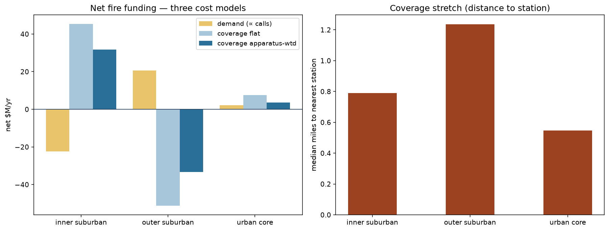

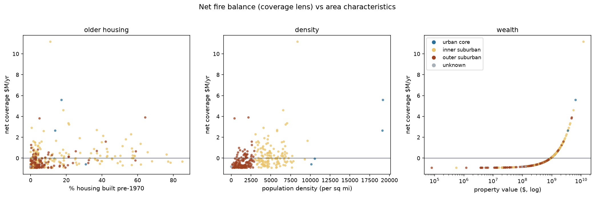

### 6.4 AFD in the context of the full City budget

To read the fire dollars correctly, it helps to see AFD inside the whole City of Austin budget. In **FY2024-25** the City adopted a **$5.9 billion** all-funds budget, of which the tax-supported **General Fund is $1.4 billion**. The four public-safety departments (Police, Fire, EMS, Forensics) together are **64.8%** of the General Fund. AFD's **≈$264M** is roughly **19% of the General Fund** — the second-largest department after police.[^budgetfig]

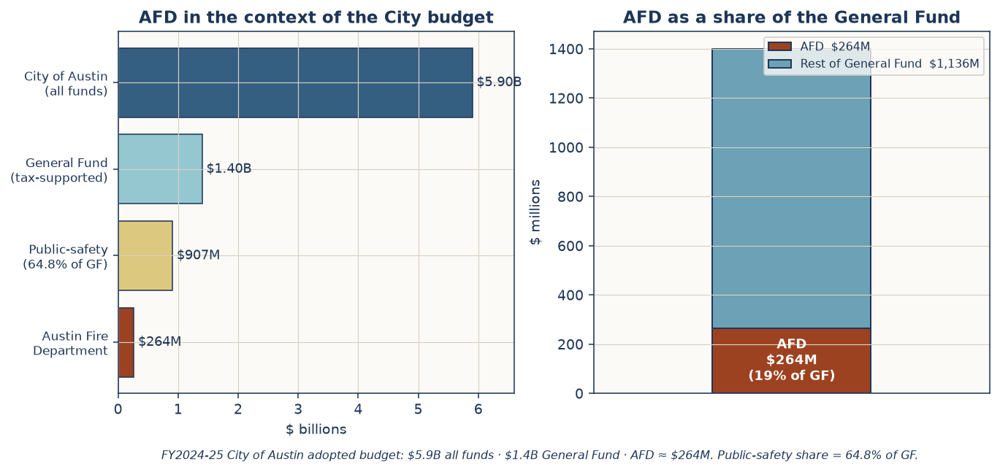

[^budgetfig]: City of Austin, *FY 2024–25 Approved Budget* — $5.9B all-funds; General Fund ≈$1.4B; adopted August 14, 2024. Secondary coverage: Luz Moreno-Lozano, "Austin Adopts Nearly $6 Billion Budget, the Largest in City History," *KUT News*, August 14, 2024, https://www.kut.org/austin/2024-08-14/austin-texas-city-council-5-9-billion-budget-2024-2025-fiscal-year; Laura Figi, "What to Know About Austin's 2024–2025 City Budget," *ATXtoday* (6AM City), August 15, 2024, https://atxtoday.6amcity.com/city/austins-2024-2025-budget. The approved AFD figure is $262.2M; the report's ≈$264M matches the proposed-budget figure (see [§11](#11--validation-appendix)). Built in `report_pipeline/15_build_report_figures.py` (`fig_afd_vs_city_budget`).

---

## 7 · Places you know

The numbers are easier to trust against places you can actually picture. The companion **[interactive 3D map](../outputs/fire_fiscal_interactive_map.html)** lets you toggle four layers — value-per-acre (extruded), fire net balance, fire stations, and these landmark pins — and click any zone for its value, pays-in, and net.


| Landmark | Colloquial read | Productivity signal |
|---|---|---|
| **Downtown Austin** | high-rise office, condo, hotel core | metro **peak** value/acre ($17–43M/acre); biggest fire subsidizer |
| **The Domain** | dense north mixed-use "second downtown" | very high value/acre; net contributor |
| **Mueller** | redeveloped airport, dense urbanism | high value/acre; net contributor |
| **West Lake Hills** | wealthy low-density enclave | pays its way — high value clears the bar despite low density |
| **Lakeway / Bee Cave** | big-lot high-value Hill Country | strengthen under the road-cost model (few road-miles) |
| **Round Rock** | growth suburb; historic square | old-town square is a local value peak; surrounds are mixed |
| **Northland / north-central** | older north-central corridor | mixed — demand-heavy under the call lens |
| **Georgetown** | growth suburb, large footprint | **flips to net drain** under the road-cost model |
| **Kyle / Buda** | fast-growing outer suburbs | **net drains** — lots of pavement per dollar of value |
| **San Marcos** | outer-metro college town | net drain under **both** cost models; local square is a peak |

Below the named landmarks sits the **exact ranking** — the AFD response areas (by their operational zone code and urban class) that contribute and drain the most under the coverage lens, with each zone's measured value per acre. The pattern is strong though not airtight: the top four contributors are very high-value zones ($20–46M/acre), led by the downtown zone (classed *inner suburban* by the residential-density scheme — see [§6.3](#63-fire-service--the-same-shape-with-consumption-data)), while the fifth is a populous low-value outer zone — and every one of the biggest drains is a low-value outer/inner-suburban zone. The drains cluster near **−$0.93M** because that is the floor — a zone holding almost no taxable value still consumes one zone's share of standby (`1/285 × $264M`).

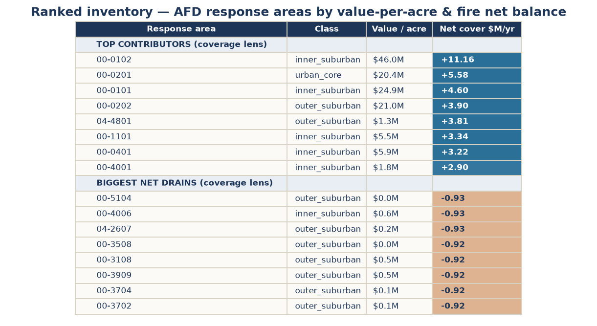

*Full 285-area ranking in `outputs/colloquial_inventory.csv`; regenerates from the parquet + `fire_net_balance.geojson` via `report_pipeline/15_build_report_figures.py` (`fig_colloquial_inventory`).*

---

## 8 · Why the data support the conclusion

The finding holds because three independent measurements point the same way:

1. **Property value per acre** — from appraisal rolls — shows low-density land produces less value (and so less tax) per acre.
2. **Road-miles** — from the federal road network — shows low-density land needs more pavement per dollar of value.
3. **Fire incidents + station standby** — from dispatch and facility data — shows low-density land needs more fire coverage per dollar of value, and sits farther from it.

These come from **different agencies, in different units, by different methods**, yet they agree. A bias in any one — the blended tax rate, say, or the uniform-cost assumption — can't explain why all three line up. Two checks back this up: the fiscal result survives swapping the cost basis from acres to road-miles, and the fire result survives swapping flat-per-zone standby for apparatus-weighted standby. Each time the size of the gap changes; the direction doesn't.

---

## 9 · Limitations

- **Calibration, not budgets.** Both fiscal cost models are calibrated to break even metro-wide, not to actual municipal expenditure; absolute dollars are first-order. The AFD budget figure scales the fire dollars only — it does not affect the relative pattern.
- **Tax rate.** A blended ~2.1% effective rate is used; real per-jurisdiction rates vary, but a uniform rate cancels in the relative comparison.
- **Fire scope.** AFD / City of Austin only. Suburban **ESD** fire departments run separate departments with no comparable open incident data, so they are stated as out of scope rather than silently dropped; **fire calls only — EMS/medical excluded**; three years (2022–2024). Pays-in denominators count **Travis parcels only**, so the few served zones spilling into Williamson/Hays have their value — and hence pays-in — modestly understated.
- **Infrastructure proxy.** Road-miles omit water/sewer line-miles and service frequency; apparatus weighting omits crew-shift detail and assigns each zone its *nearest* station as a proxy for first-due. Coverage cost allocated per zone. The §6.2 city ledger counts all local roads inside each label but only developed-parcel (≤ 5-acre) revenue — an asymmetry that overstates the road-cost deficit of the unincorporated area (see §6.2).
- **Vintage mix.** Travis values are 2025 certified; Williamson/Hays are their current published cycle. All ~2025; not identically dated.

Each of these affects how big the numbers are, not which way they point — which is why the three-way agreement still carries the conclusion.

---

## 10 · Master appendix — figures & tables

| Figure | File | Status |
|---|---|---|
| Data-inputs flow diagram | `outputs/fig_data_inputs_flow.png` | built |
| Concept: value per acre | `outputs/fig_concept_value_per_acre.png` | built |
| Concept: fiscal break-even | `outputs/fig_concept_breakeven.png` | built |
| Concept: coverage vs demand | `outputs/fig_concept_coverage_demand.png` | built |
| Palette swatch | `outputs/fig_palette_swatch.png` | built |
| AFD vs City budget | `outputs/fig_afd_vs_city_budget.png` | built |
| Interactive-map preview | `outputs/fig_interactive_map_preview.png` | built |
| Validation reconciliation | `outputs/validation_summary.png` | built |
| Fiscal: land vs road model | `outputs/fiscal_land_vs_road.png` | built (embedded §6.2) |
| Fire: 3 models + distance | `outputs/fire_apparatus_distance.png` | built (embedded §6.3) |
| Fire: net balance vs characteristics | `outputs/fire_equity_scatter.png` | built (embedded §6.3) |
| Ranked inventory by zone | `outputs/fig_colloquial_inventory.png` | built (embedded §7) |

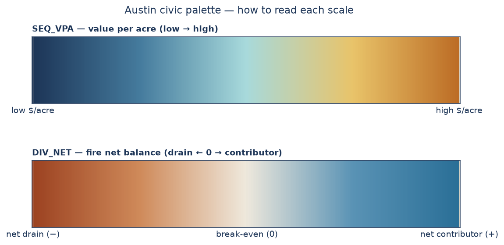

#### The color key

Two scales do all the work. The **sequential** one (`#1d3557 → #457b9d → #a8dadc → #e9c46a → #bc6c25`) means *value per acre, low → high*. The **diverging** one (burnt-orange `#9c4221` ↔ limestone `#efe9dd` ↔ bluebonnet `#2a6f97`) means *fire net balance*, centered on break-even. Both are defined once in `report_pipeline/viz_palette.py` and reused by the explainer diagrams, the map preview, and the interactive map, so a color means the same thing wherever you see it. The three analytical charts in §6.2–6.3 come straight from the analysis notebooks and keep their own coloring, spelled out in each caption.

Color is a shortcut, not the only signal: the two ends of the diverging scale can be hard to tell apart in print or for colorblind readers, so every chart and table also carries the actual numbers. (A grayscale-legible version of the map is in the Kindle/e-ink build.)

---

## 11 · Validation appendix

The headline numbers pass a machine-generated reconciliation (`notebooks/validation.ipynb` → `outputs/validation_report.csv`). **All 24 checks are green.** The table has two kinds of row and is explicit about which is which: the **recomputed checks** re-derive their numbers from the source files on every run — incident and parcel counts, totals, the break-even, the fire net-balance (rebuilt from scratch rather than read from the analysis notebook), the §6.2 city verdicts, the §6.3 class table, and station distances, all against the full 724,639-parcel roll — while the five **citation-log rows** record the externally sourced constants (budget figures, tax rate) with their sources rather than measuring them. The net-balance conservation check holds to machine precision (`1.1e-16`), and the run also exports `processed_data/fire_net_balance.geojson` that feeds the interactive map's fire layer.

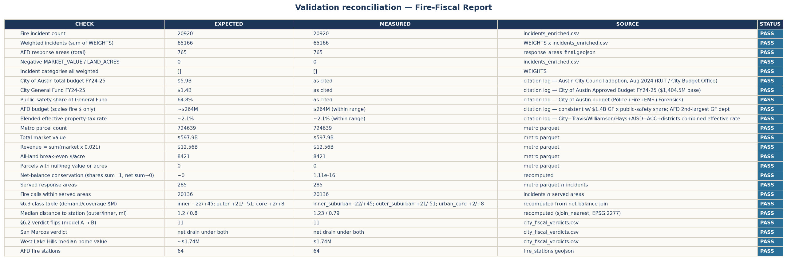

**External-constant sources (re-verified against the live web, July 1, 2026):**

- City of Austin FY2024-25 approved budget **$5.9B all funds**, **General Fund ≈$1.4B**: City of Austin, [*Fiscal Year 2024–25 Approved Budget*](https://austin.widen.net/view/pdf/urye2vx23m/FY-2024-25-City-of-Austin-Approved-Budget.pdf) (adopted August 14, 2024; the [Budget Office page](https://www.austintexas.gov/budget-excellence/city-budget) links the current document); Moreno-Lozano, ["Austin Adopts Nearly $6 Billion Budget"](https://www.kut.org/austin/2024-08-14/austin-texas-city-council-5-9-billion-budget-2024-2025-fiscal-year) (*KUT News*, Aug. 14, 2024). Public-safety departments (Police + Fire + EMS + Forensics) ≈ **mid-60s % of the General Fund** (the report uses 64.8%).
- AFD budget for FY2024-25: **$262.2M approved** (*FY 2024–25 Approved Budget*, pp. 300, 453). The **≈$263–264M** in secondary coverage (Figi, ["What to Know About Austin's 2024–2025 City Budget"](https://atxtoday.6amcity.com/city/austins-2024-2025-budget), *ATXtoday*, Aug. 15, 2024) matches the *proposed* budget; the model's $264M constant scales the fire dollars only. AFD is the second-largest General Fund department, ≈19% of the GF.
- Blended effective property-tax rate **≈2.1%** — City of Austin + Travis/Williamson/Hays counties + AISD + ACC + special districts. Adopted 2024 rates for the four largest overlapping units sum to ≈1.87% (≈1.98% adding Central Health): Travis County Tax Office, ["Truth in Taxation Summary"](https://www.traviscountytx.gov/tax-rates). The blend's remainder stands in for the other special districts; used uniformly, it cancels in every relative comparison.

---

## 12 · Glossary

Extends the 21-term glossary in `docs/RESEARCH_CONTEXT.md` with the financial concepts this report adds.

| Term | Definition |
|---|---|
| **Value per acre** | Market value ÷ land acres — productivity of land normalized to the unit infrastructure scales with. |
| **Market value** | Appraisal district's estimate of sale price; the base for property-tax revenue here. |
| **Appraised / assessed value** | Market value after caps/exemptions; the legal tax base (used for the tax-per-acre lens). |
| **Effective tax rate** | Blended rate across all overlapping jurisdictions applied to market value (~2.1% here). |
| **Fiscal productivity / break-even** | Whether an area's revenue covers its cost-to-serve; above = net contributor, below = subsidized. |
| **Cost-to-serve** | Modeled public cost of an area, allocated either by land area (Model A) or local road-miles (Model B). |
| **Value per road-mile** | Strong Towns metric: property value divided by the local road network an area carries. |
| **Pays-in (fire)** | An area's share of citywide property value × the AFD budget — what its taxes contribute to fire. |
| **Demand lens** | Fire "use" measured as cost-weighted call volume. |
| **Coverage lens** | Fire "use" measured as the fixed standby cost of keeping a first-due company per zone — the cost that dominates a fire budget. |
| **Apparatus weighting** | Scaling cost by the actual equipment/crew committed (ladder/quint > engine; structure fire > trash). |
| **Net balance** | pays-in − use, in $/yr; positive = net contributor, negative = net drain. |
| **PVS / sales ratio** | Comptroller's median appraisal-to-sale ratio, used to make values comparable across counties. |
| **Winsorize** | Cap a distribution at a percentile (95th–99th here, varying by figure) so extreme outliers don't distort display scales. |
| **H3 hexagon** | Uber's hexagonal spatial index; parcels are aggregated to H3 res-8 cells for the metro value map. |
| **Response area** | AFD's first-due operational zone (765 total, 285 served by ≥1 call + value). |
| **EPSG:2277** | Texas Central State Plane (feet) — the projected CRS used for areas and distances. |

*(See `docs/RESEARCH_CONTEXT.md` for AFD, ETJ, ACS, NFIRS, urban-core/inner/outer thresholds, single-stair, HOME, WUI, zoning codes, and more.)*

---

## 13 · Code & pseudo-code appendix

### Pseudo-code — the three models

```
MODEL 1 — value per acre
  for each parcel:
      acres = CAD_acres or legal_acreage or geometry_area(EPSG:2277)
      value_per_acre = market_value / acres
  winsorize at p99 for display; drop acres < 0.01
  value_per_acre_adj = (market_value / pvs_ratio[county]) / acres

MODEL 2 — fiscal break-even
  revenue        = Σ market_value × 0.021
  # Model A: cost ∝ area
  break_even/ac  = revenue / Σ acres        # all land: $8,421/ac
  # §6.2 city table: recalibrated on developed land only (parcels ≤ 5 ac) → $30,781/ac
  net/ac         = value × 0.021 / acres − break_even/ac
  # Model B: cost ∝ local road-miles (TIGER, no interstates)
  cost_share     = area_road_miles / Σ road_miles
  net            = value_share − cost_share

MODEL 3 — fire use vs pays-in
  weighted_calls = Σ incident × WEIGHTS[type]
  value_share    = area_value / Σ value
  pays_in        = value_share × AFD_BUDGET
  net_demand     = (value_share − weighted_calls/Σ) × AFD_BUDGET
  net_coverage   = (value_share − 1/N_served) × AFD_BUDGET
  net_coverage_apparatus = scale coverage_share by nearest-station apparatus weight
  dist_mi        = distance(area_centroid, nearest_station)   # EPSG:2277
```

### Real code excerpts

**Revenue & cross-county adjustment** — `report_pipeline/13_build_metro_parcels.py`:

```python
g["value_per_acre"] = g["market_value"] / g["land_acres"]
g["pvs_ratio"] = g["county"].map(PVS)                      # 1.00 / 0.96 / 0.97
g["value_per_acre_adj"] = g["value_per_acre"] / g["pvs_ratio"]
g["tax_per_acre"] = g["taxable_value"] * EFFECTIVE_TAX_RATE / g["land_acres"]
```

**Fire net balance** — `notebooks/fire_use_vs_pays.ipynb` cell 8:

```python
t['value_share']    = t['prop_value'] / t['prop_value'].sum()
t['callcost_share'] = t['wcalls']     / t['wcalls'].sum()
t['coverage_share'] = 1.0 / len(t)     # each zone = one staffed company
t['net_demand_M']   = (t['value_share'] - t['callcost_share']) * AFD_BUDGET / 1e6
t['net_coverage_M'] = (t['value_share'] - t['coverage_share']) * AFD_BUDGET / 1e6
```

### Reproducibility runbook

Every figure and number regenerates from committed code over public data:

1. `report_pipeline/12_parse_tcad_roll.py` → parse a certified TCAD roll (`PROP.TXT`) to per-parcel values.
2. `report_pipeline/13_build_metro_parcels.py` → Travis geometry + roll values + Williamson/Hays → metro parcel set.
3. `notebooks/value_per_acre_metro.ipynb` · `fiscal_productivity.ipynb` · `fire_use_vs_pays.ipynb` → the three models.
4. `notebooks/validation.ipynb` → the validation gate (`outputs/validation_report.csv`).
5. `report_pipeline/15_build_report_figures.py` → the explainer/diagram figures (+ data-charts when the parquet is present).
6. `notebooks/interactive_map.ipynb` → `outputs/fire_fiscal_interactive_map.html`.
7. `report_pipeline/14_build_report_pdf.py` → this document as a styled PDF.

**On a fresh clone**, the large data files (`parcels_value_per_acre_metro.parquet`, `fire_stations.geojson`, `metro_highways.geojson`) aren't tracked in git. Rebuild the parcels first (`report_pipeline/12_parse_tcad_roll.py` → `report_pipeline/13_build_metro_parcels.py`), then run the steps above in order. Each notebook and script checks whether its data is present and simply skips the parts it can't run yet, so nothing errors — the missing figures and map layers fill in once the data is there.

---

## 14 · References

For policy context (single-stair building code, HOME initiative, WUI, NFPA 1710, zoning codes) and the operational glossary (AFD, ETJ, ACS, NFIRS, urban-core/inner/outer density thresholds), see **`docs/RESEARCH_CONTEXT.md`**. For the per-field data dictionary, see **`docs/DATA_DICTIONARY.md`**.

### Bibliography

Every external source cited in the notes above, alphabetized. All URLs accessed July 1, 2026.

- Austin Fire Department. "AFD Fire Incidents 2023–2025." City of Austin Open Data Portal, dataset `v5hh-nyr8`. Updated April 20, 2026. https://data.austintexas.gov/Public-Safety/AFD-Fire-Incidents-2023-2025/v5hh-nyr8. (Analyzed over the 2022–2024 window; the dataset title rolls forward annually.)
- Austin Fire Department. "AFD Response Areas" (`BOUNDARIES_afd_response_areas`). ArcGIS feature layer, CTM 911 Addressing GIS. https://services.arcgis.com/0L95CJ0VTaxqcmED/arcgis/rest/services/BOUNDARIES_afd_response_areas/FeatureServer/0.
- City of Austin. *Fiscal Year 2024–25 Approved Budget*. Austin, TX: City of Austin, adopted August 14, 2024. https://austin.widen.net/view/pdf/urye2vx23m/FY-2024-25-City-of-Austin-Approved-Budget.pdf.
- City of Austin. "Fire Stations" (`LOCATION_fire_stations`). ArcGIS feature service. https://services.arcgis.com/0L95CJ0VTaxqcmED/arcgis/rest/services/LOCATION_fire_stations/FeatureServer.
- City of Austin, Housing and Planning Department. "Land Database Dash View" (2023 Land Database), layer 93. ArcGIS feature service. Last edited May 28, 2026. https://services.arcgis.com/0L95CJ0VTaxqcmED/arcgis/rest/services/2023_Land_Database_Dash_View/FeatureServer/93.
- Figi, Laura. "What to Know About Austin's 2024–2025 City Budget." *ATXtoday* (6AM City), August 15, 2024. https://atxtoday.6amcity.com/city/austins-2024-2025-budget.
- Hays County Development Services, GIS Division. "Hays County Parcels." ArcGIS feature service, layer 0. Last updated March 2026. https://services5.arcgis.com/bVphnK8rPe5MHUSr/arcgis/rest/services/Hays_County_Parcels/FeatureServer/0.
- Herriges, Daniel. "Value Per Acre Analysis: A How-To for Beginners." *Strong Towns*, October 19, 2018. https://www.strongtowns.org/journal/2018/10/19/value-per-acre-analysis-a-how-to-for-beginners.
- International Association of Oil & Gas Producers. "NAD83 / Texas Central (ftUS): EPSG:2277." EPSG Geodetic Parameter Dataset. https://epsg.org/crs_2277/NAD83-Texas-Central-ftUS-.html.
- Knight, Steven. "Doing More with Less: Fire Department Budgets, Fiscal Responsibility." *FireRescue1*, August 14, 2018. https://www.firerescue1.com/fire-chief/articles/doing-more-with-less-fire-department-budgets-fiscal-responsibility-GTj33j3axJ2tfshe/.
- Marohn, Charles L., Jr. *Strong Towns: A Bottom-Up Revolution to Rebuild American Prosperity*. Hoboken, NJ: Wiley, 2019.
- Minicozzi, Joseph. "The Smart Math of Mixed-Use Development." *Planetizen*, January 23, 2012. https://www.planetizen.com/node/53922.
- Moreno-Lozano, Luz. "Austin Adopts Nearly $6 Billion Budget, the Largest in City History." *KUT News*, August 14, 2024. https://www.kut.org/austin/2024-08-14/austin-texas-city-council-5-9-billion-budget-2024-2025-fiscal-year.
- National Fire Protection Association. *NFPA 1710: Standard for the Organization and Deployment of Fire Suppression Operations, Emergency Medical Operations, and Special Operations to the Public by Career Fire Departments*. 2020 ed. Quincy, MA: NFPA, 2020. https://www.nfpa.org/codes-and-standards/nfpa-1710-standard-development/1710. (Consolidated into NFPA 1750 for the 2026 edition.)
- Pegram, Steve. "Budget Breakdown: The Real Cost of Operating a Fire Department." *FireRescue1*, October 8, 2021. https://www.firerescue1.com/fire-products/administration-billing/articles/budget-breakdown-the-real-cost-of-operating-a-fire-department-uB62rUFtPgUf8ZpZ/.
- Texas Comptroller of Public Accounts. "2024 Appraisal District Ratio Study." Conducted under Tex. Tax Code § 5.10. County worksheets — Travis (227): https://comptroller.texas.gov/auto-data/PT2/ratio-study/2024/2270000001A.php; Williamson (246): https://comptroller.texas.gov/auto-data/PT2/ratio-study/2024/2460000001A.php; Hays (105), 2022 study (biennial cycle): https://comptroller.texas.gov/auto-data/PT2/ratio-study/2022/1050000001A.php.
- Texas Tax Code. Title 1, Property Tax Code. Texas Constitution and Statutes. https://statutes.capitol.texas.gov/. (Cited in the notes: § 5.10, § 23.23, § 26.01, § 26.16.)
- Travis Central Appraisal District. "Public Information." 2025 Certified Export (July) — certified appraisal-roll data download. https://traviscad.org/publicinformation/.
- Travis County Tax Office. "Truth in Taxation Summary." Adopted tax rates for taxing units in Travis County, posted per Tex. Tax Code § 26.16. https://www.traviscountytx.gov/tax-rates.
- Uber Technologies. *H3: A Hexagonal Hierarchical Geospatial Indexing System*. Documentation. https://h3geo.org/.
- U.S. Census Bureau. "Appendix E: MAF/TIGER Feature Class Code (MTFCC) Definitions." In *TIGER/Line Shapefiles 2023 Technical Documentation*. October 2023. https://www2.census.gov/geo/pdfs/maps-data/data/tiger/tgrshp2023/TGRSHP2023_TechDoc.pdf.
- U.S. Census Bureau. "Cartographic Boundary Files: Places, Texas, 1:500,000" (`cb_2023_48_place_500k`). 2023 vintage. https://www.census.gov/geographies/mapping-files/time-series/geo/cartographic-boundary.html.
- U.S. Census Bureau. "TIGER/Line Shapefiles: Roads, 2023." U.S. Department of Commerce, Geography Division. https://www.census.gov/geographies/mapping-files/time-series/geo/tiger-line-file.html.
- U.S. Census Bureau. "Total Population" (B01003), "Units in Structure" (B25024), and "Year Structure Built" (B25034). American Community Survey, 2018–2022 Five-Year Estimates, census-tract level. Via the Census Bureau API: https://api.census.gov/data/2022/acs/acs5.
- Williamson County GIS. "WCAD Parcels." Parcel geometry and appraisal values from the Williamson Central Appraisal District. ArcGIS map service, layer 0; updated daily. https://gis.wilco.org/arcgis/rest/services/public/county_wcad_parcels/MapServer/0.

---

## 15 · To be done {: .todo-page }

<div class="unfinished-banner">UNFINISHED</div>

> **This page is a worklist, not a finding.** The July 1, 2026 source-verification pass surfaced three places (items 1–3) where a verified source disagrees with a constant the report uses; a July 7, 2026 code-vs-claims review added three more (items 4–6) where a modeling choice should be revisited in the numbers. Each is disclosed at its footnote or section; **none has been resolved in the numbers yet.**

1. **Soften the blended tax rate (~2.1% → ~2.0%)?** The adopted 2024 rates for the four largest overlapping jurisdictions sum to ≈1.87% (≈1.98% adding Central Health) per the Travis County Tax Office "Truth in Taxation Summary" — the report's 2.1% blend sits above what the documented rates support. A uniform rate cancels in every relative comparison, so only the absolute dollar figures would rescale. (Disclosed at the §2.3 rate note.)
2. **Decide the AFD budget constant: $264M (proposed) vs $262.2M (approved).** The *FY 2024–25 Approved Budget* puts AFD's General Fund requirement at $262,205,476; the model's `AFD_BUDGET = 264_000_000` matches the widely reported *proposed* figure. Switching rescales every fire dollar by ~0.7%; the pattern is unchanged. (Disclosed at the §5.4 budget note.)
3. **Pin the fire-incident vintage before any re-pull.** Open-data dataset `v5hh-nyr8` now carries the rolling title "AFD Fire Incidents 2023–2025"; this analysis used the 2022–2024 window. A re-download today would silently swap the incident set — archive the analyzed extract or filter by date on refresh. (Disclosed at the §4.2 incidents note.)
4. **Consider a ladder premium in the apparatus weights.** `APP_W` currently weighs a ladder the same as an engine (`LAD 1.0 = ENG 1.0`; only quints carry a premium) — the inner-area apparatus effect comes from stations housing more units, not costlier ones. If a ladder company genuinely costs more to staff, raise `LAD` above 1.0 in `notebooks/fire_use_vs_pays.ipynb` cell 10 and re-run; §2.6/§6.3 prose now describes the weighting as implemented. (Disclosed at §2.6.)
5. **Populate `taxable_value` for Williamson/Hays, or retire the metro tax-per-acre framing.** The assessed-value column is Travis-only (`13_build_metro_parcels.py` fills it from the TCAD roll's `appraised_val`; the Williamson/Hays feeds carry market value only), so `tax_per_acre` is NaN outside Travis. (Disclosed at §2.1 and the §5.2 revenue note.)
6. **Sensitivity-check the Model B unincorporated asymmetry.** The road-cost ledger charges "Unincorporated" for every local road outside city limits but counts only its ≤ 5-acre parcel revenue. Re-run including large-parcel revenue (or clipping rural roads) to bound how much of the −$2B road-cost deficit the asymmetry explains. (Disclosed at §6.2 and §9.)

---

*Generated by the Austin Housing & Land Use Working Group — Research Hub. Charts and the interactive map share a single color module (`report_pipeline/viz_palette.py`); every headline number is reconciled in `outputs/validation_report.csv`.*
